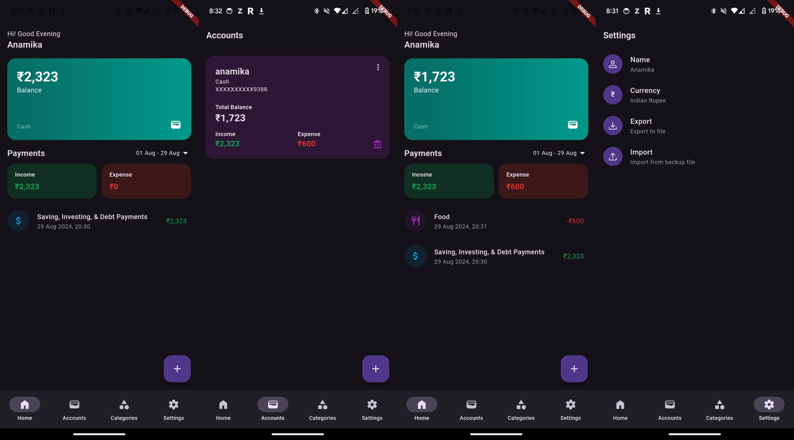

# FinBook - Expense Tracker App

FinBook is a Flutter application that helps you track your expenses and manage category budgets. It provides a user-friendly interface to enter and categorize your expenses, giving you insights into your spending habits and helping you stay within your budget.



## Features

- Track and record your expenses conveniently.
- Categorize your expenses into different categories.
- Set monthly budgets for each category and monitor your spending.
- View detailed expense reports and statistics.
- Easily search and filter your expenses.
- Export expense data for further analysis.

## Installation

1. Clone the repository:

```bash
git clone https://github.com/anamika1804/Expense_Track.git
```

2. Change to the project directory:

```bash
cd Expense_track
```

3. Install dependencies:

```bash
flutter pub get
```

4. Run the app:

```bash
flutter run
```

## Usage

- Upon launching the app, you will be presented with the home screen.
- Click on the "+" button to add a new expense.
- Enter the expense details, including the amount, category, and description.
- Click "Save" to add the expense.
- Navigate to the "Categories" tab to manage your expense categories and budgets.
- Set monthly budgets for each category by clicking on the category and entering the desired amount.
